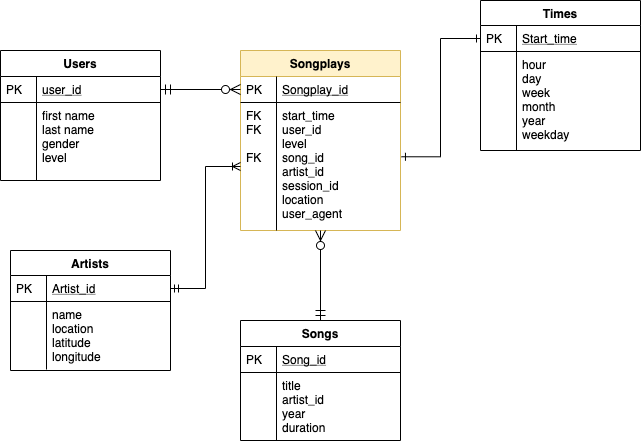

Sparkify's ETL for music streaming app analytics
===============

## 1. Introduction and Purpose

Sparkify, a music streaming company, wants to capture its users behaviour and collect their logs and activities into a database to perform some analytics.  
The goal for Sparkify is to have a normalized database to analyze their users' behavior and the songs that they have been listening to.

To this aim, this repo wants to be a complete Extract Transform and Loading (ETL) of Sparkify's data into a PostgreSQL Relational Database. This would allow Sparkify to have the data tidied up into a star schema presented in the image below.

Here is an Entity Relational diagram of how the database has been organised:  

The dimension tables of **Songs** and **Artists** are fed from the Sparkify Songs data, while the others are fed from the data provided by the users log activity.

### Fact Table: Songplays
The fact table **Songplays** represents what, who, when and where a song has been played. It uses songplays_id as a serial primary key, meaning that the keys are generated in order of natural numbers. **User_id, Song_id, and Artist_id** are foreign keys in the respective other three dimension tables.  
The other keys are self explanatory.

## Choice of RDBMS
The choice of using PostgreSQL has been dictated by the important fact that Sparkify needed to handle json files, PostgreSQL capacity of dealing with JSON format and its SQL nature made it the best candidate for this project.

## How to use this repo
To perform the ETL, the data engineer will have to have the data collected in the folder _data_ and the respective subfolders *log_data* and *song_data* as provided in this repo.  
To open a connection with PostgreSQL and create the empty database, run into your terminal the command:

>$ python create_tables.py

While to perform the ETL, run

>$ python etl.py

### ETL

The ETL sits in the file _etl.py_ and it is mainly composed by three functions:
1. **process_song_file**: This function opens a song file and insert song's and artist's features (columns) in the respective tables.

2. **process_log_file**: This function opens the logs' file and add the time features and the users columns to the respective tables.

3. **process_data**: This function applies the function specified in the parameters to all the files in the path as well specified in the parameters and serves as a progress monitor tool during the ETL execution.

 
