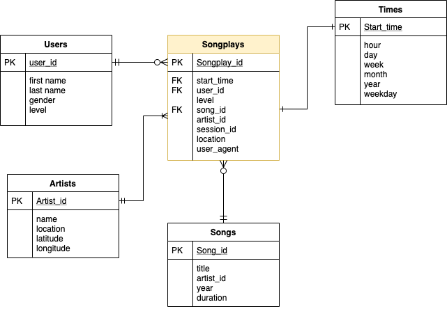

# Project: Data Warehouse with AWS

## Introduction
A music streaming startup, Sparkify, has grown their user base and song database and want to move their processes and data onto the cloud. Their data resides in S3, in a directory of JSON logs on user activity on the app, as well as a directory with JSON metadata on the songs in their app.

The project is composed by an ETL process to store data into the Redshift Data Warehouse.

The two datasets used for this projects are stored in S3.

## Song Datasets

It is a subset of real data from the [Million Song Dataset](http://millionsongdataset.com/). The files are partitioned by the first three letters of each song's track ID:

Example:
```
{"num_songs": 1, "artist_id": "ARJIE2Y1187B994AB7", "artist_latitude": null, "artist_longitude": null, "artist_location": "", "artist_name": "Line Renaud", "song_id": "SOUPIRU12A6D4FA1E1", "title": "Der Kleine Dompfaff", "duration": 152.92036, "year": 0}
```

## Log Datasets
The second dataset consists of log files in JSON format generated by this event simulator based on the songs in the dataset above. These simulate app activity logs from an imaginary music streaming app based on configuration settings.  
The log files in the dataset you'll be working with are partitioned by year and month.

Example:
```
{"artist":null,"auth":"Logged In","firstName":"Walter","gender":"M","itemInSession":0,"lastName":"Frye","length":null,"level":"free","location":"San Francisco-Oakland-Hayward, CA","method":"GET","page":"Home","registration":1540919166796.0,"sessionId":38,"song":null,"status":200,"ts":1541105830796,"userAgent":"\\"Mozilla\\/5.0 (Macintosh; Intel Mac OS X 10_9_4) AppleWebKit\\/537.36 (KHTML, like Gecko) Chrome\\/36.0.1985.143 Safari\\/537.36\\"","userId":"39"}
```

## Star Schema for Analytics

The schema consists of one **fact table: Songplays**, with the following columns:
```
songplay_id, start_time, user_id, level, song_id, artist_id, session_id, location, user_agent
```

and four **dimension tables** composed in the following structure:

* **Users**: ```user_id, first_name, last_name, gender, level```
* **Songs**: ```song_id, title, artist_id, year, duration```
* **Artists**: ```artist_id, name, location, lattitude, longitude```
* **Time**: ```start_time, hour, day, week, month, year, weekday```

The schema follows the structure representes in the following image:  



## How to use this repo:

### 1. Setup configuration file **dhw.cfg** as follows:  
```
[AWS]
KEY     =
SECRET  =

[IAM_ROLE]
ARN          = 'your_IAM_ROLE_ARN'

[S3]
LOG_DATA     = 's3://udacity-dend/log_data'
LOG_JSONPATH = 's3://udacity-dend/log_json_path.json'
SONG_DATA    = 's3://udacity-dend/song_data'

[DWH]
DWH_CLUSTER_TYPE = multi-node
DWH_NUM_NODES    = 4
DWH_NODE_TYPE    = dc2.large

DWH_IAM_ROLE_NAME      =
DWH_CLUSTER_IDENTIFIER =
DWH_DB                 =
DWH_DB_USER            =
DWH_DB_PASSWORD        =
DWH_PORT               = 
```

At this stage you won't be required to fill out the `ARN` variable.

Optional: create a python environment and run  

    $ pip install -r requirements.txt

### 2. Check if you can connect to the DB

Take note of the output of step 1 and add the following to the `dhw.cfg` file:

```
[CLUSTER]
HOST        = 'your_dwh_endpoint'
DB_NAME     = 'your_DWH_DB'
DB_USER     = 'your_dwhuser_sparkify'
DB_PASSWORD = 'your_DWH_DB_PASSWORD'
DB_PORT     = 'your_DWH_PORT'
```

and run

    $ python test_connection.py

### 3. Create Cluster

    $ python create_cluster.py

### 4. Create tables

    $ python create_tables.py

### 5. Load data into DWH

    $ python etl.py


---
Resources:
1. [Getting Started with Amazon Redshift](https://aws.amazon.com/redshift/getting-started/?p=rs&bttn=hero&exp=b)
2. [How to convert epoch to datetime redshift](https://stackoverflow.com/questions/39815425/how-to-convert-epoch-to-datetime-redshift)