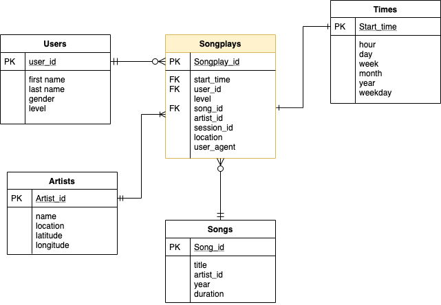

# Project 4 - Data Lake using Spark 

## Introduction

A music streaming startup, Sparkify, has grown their user base and song database and want to move their data warehouse into a data lake. Their data resides in S3, in a directory of JSON logs on user activity on the app, as well as a directory with JSON metadata on the songs in their app.


The two datasets used for this projects are stored in S3.  
The project is composed by an ETL (Apache Spark Application) to store data back into S3.

## Song Datasets

It is a subset of real data from the [Million Song Dataset](http://millionsongdataset.com/). The files are partitioned by the first three letters of each song's track ID:

Example:
```
{"num_songs": 1, "artist_id": "ARJIE2Y1187B994AB7", "artist_latitude": null, "artist_longitude": null, "artist_location": "", "artist_name": "Line Renaud", "song_id": "SOUPIRU12A6D4FA1E1", "title": "Der Kleine Dompfaff", "duration": 152.92036, "year": 0}
```

## Log Datasets
The second dataset consists of log files in JSON format generated by this event simulator based on the songs in the dataset above. These simulate app activity logs from an imaginary music streaming app based on configuration settings.  
The log files in the dataset you'll be working with are partitioned by year and month.

Example:
```
{"artist":null,"auth":"Logged In","firstName":"Walter","gender":"M","itemInSession":0,"lastName":"Frye","length":null,"level":"free","location":"San Francisco-Oakland-Hayward, CA","method":"GET","page":"Home","registration":1540919166796.0,"sessionId":38,"song":null,"status":200,"ts":1541105830796,"userAgent":"\\"Mozilla\\/5.0 (Macintosh; Intel Mac OS X 10_9_4) AppleWebKit\\/537.36 (KHTML, like Gecko) Chrome\\/36.0.1985.143 Safari\\/537.36\\"","userId":"39"}
```

## Star Schema for Analytics

The schema consists of one **fact table: Songplays**, with the following columns:
```
songplay_id, start_time, user_id, level, song_id, artist_id, session_id, location, user_agent
```

and four **dimension tables** composed in the following structure:

* **Users**: ```user_id, first_name, last_name, gender, level```
* **Songs**: ```song_id, title, artist_id, year, duration```
* **Artists**: ```artist_id, name, location, lattitude, longitude```
* **Time**: ```start_time, hour, day, week, month, year, weekday```

The schema follows the structure representes in the following image:  



## How to use this repo:

To take advantage of Spark's distributed computation power, the script should ideally be run in an e.g. AWS EMR cluster. To do so, variour approaches are possible; following are two possibilities:

- Upload into the cluster and run the Jupyter notebook in this repo (select pySpark as kernel for the notebook)

- * Secure copy the python script `etl.py` into the cluster:  
  ```scp -i <pathToYourKey> <fileToCopy> <username>@<ClusterAddress>:~/<ClusterPath>```
  * Run the script:  
    ```spark-submit etl.py --master yarn --deploy-mode client --driver-memory 4g --num-executors 2 --executor-memory 2g --executor-core 2```

In neither of the two above approaches is needed to fill the `dhw.cfg` file with your AWS credentials, although if you wish to continue with a different method (e.g. locally run the script/notebook), you might be asked to do so:

  * Setup a configuration file **dhw.cfg** as follows:  
```
[AWS]
AWS_ACCESS_KEY_ID     = yourAccessKeyID
AWS_SECRET_ACCESS_KEY = yourSecretAccessKey
```

## How it works:

1. The ETL read data from S3:

  > -   Song data:  `s3://udacity-dend/song_data`
  > -   Log data:  `s3://udacity-dend/log_data`

2. Transforms the read data into 5 different tables and writes them back into a specified S3 bucket in [Apache Parquet](https://parquet.apache.org/) format. The Schema is presented above.
